# Agent continuity: a concrete pilot

> **Planning disposition, 2026-09-29:** Dated synthetic continuity evidence. Remaining real-agent and cross-host validation is scheduled in S3; this report is not a separate work queue. See [the plan](plan.md) and [disposition register](planning-index.md).

> **Product decision, 2026-09-29:** [The canonical storage plan](plan.md) now governs. Stow owns portable working storage; callers own execution, agent turns and sandboxing. The experiments and earlier recommendations below retain their dated context. Runner/executor requirements are deferred; agent continuity will be evaluated through a thin storage integration, not a separate Stow execution product.

Date: 2026-09-29. Tested Stow revision: `5485a3640dbeeb368324d7e2a223bc17d7d23fc5`.
Status: documentation and disposable experiment; no product implementation changes.

## Product proposition

**Prepare an agent's workspace, preserve its work, and hand it off.**

The caller selects the agent and execution environment. Stow supplies declared working data, a directory, durable checkpoints, and inspectable output. A receiving runner should be able to materialize the work without contacting the original storage provider or reconstructing the sender's machine.

This is a second first-class product hypothesis alongside disposable S3 test environments. Both depend on dependable storage and lifecycle behavior. The agent hypothesis specifically needs portable task intent, progress, and runtime requirements as well as bytes. Passing storage tests does not establish that another model can successfully continue a task.

## What was exercised

The temporary harness starts real Stow servers and uses real CLI lifecycle commands. Two separate deterministic Python workers stand in for the file operations an agent could perform. No model agent or external inference service was invoked.

```mermaid
flowchart LR
    S[Local synthetic S3 upstream] --> C[Prewarm selected object]
    C --> O[Stop upstream; read offline cache]
    O --> W[Prepare workspace with task and input]
    W --> A[Worker A validates input and saves progress]
    A --> H[Checkpoint and export handoff]
    H --> M[Move bundle; retire sender paths]
    M --> B[Adopt into new registry; worker B continues]
    B --> R[Verify output; checkpoint and inspect diff]
```

### Workload

A synthetic orders CSV contains four rows. The task is to total paid orders by customer, using integer cents. Worker A validates the input digest, selects paid rows and writes `validated.json` and `progress.json`. It exits with an intentional pause before aggregation.

The task brief, input, progress, intermediate data and worker script are checkpointed. The handoff document and archive are copied to a new directory. The entire sender directory is renamed, making all original sender paths unavailable. The original S3 processes are already stopped.

Worker B runs from an adopted workspace in a new registry with a minimal environment and no AWS/STOW/S3 variables. It verifies the input and saved intermediate digests, reads the remaining step, and writes the result. The expected total is 2,400 cents: Alice 1,500 and Bob 900.

### Observations

| Check | Result |
| --- | --- |
| Retrieve selected input from offline cache after stopping upstream | Passed |
| Worker A leaves usable partial progress and exits at its pause | Passed |
| Adopt an unmodified relocated handoff | Failed: archive reference uses sender absolute path |
| Adopt after changing `archive.path` to `checkpoint.tar.gz` | Passed |
| Generated upstream and local S3 credentials absent from adopted files | Passed for the exact generated values checked |
| Worker B produces the expected total using adopted files | Passed |
| Sender's original paths remain unavailable during continuation | Passed |
| Final diff contains only updated progress and added report | Passed |
| Appended archive bytes are rejected before destination workspace creation | Passed |

The successful path includes an explicit JSON-reference workaround. No Stow source was changed. The experiment does not support a claim that the unmodified portable handoff workflow currently works.

## What this establishes

The current implementation can preserve enough file state for a separate process to finish a partially completed task. Selected upstream bytes can be captured while access is available, used offline, and carried as declared task inputs. The receiver does not need the sender's upstream credentials for this task.

The working composition is manual: read the cached S3 object into a staging directory, prepare the workspace, stop the writer, checkpoint, publish, fix the archive reference, adopt, launch, checkpoint, diff. That sequence gives us a concrete integration target.

There are important limits:

- Both workers ran on one macOS host with the same installed Python runtime. No laptop-to-CI or edge transfer was tested.
- The pause was cooperative. This did not kill a process during a write or prove crash consistency of application state.
- A renamed sender directory is not a denied filesystem capability. The workers share the host user; this is not a sandbox test.
- Worker B followed deterministic code. A fresh model's ability to interpret the task and avoid duplicating work is still untested.
- The experiment transferred selected input bytes as files. It did not transfer a complete S3 cache or preserve all S3 metadata through workspace archives.
- The workspace HTTP facade was not involved; the CLI does not expose that composition yet.
- Archive digest checks detected modification. They do not authenticate a sender who can replace both the archive and its digest.
- Scanning for exact generated secrets is narrower than proving an arbitrary task bundle contains no sensitive data.

## The smallest useful continuation contract

The next pilot should use one small task record alongside the checkpoint. The following is a proposed contract, not a new implemented Stow API:

| Record | Required information | Owner |
| --- | --- | --- |
| Task | Objective, expected output and observable acceptance criteria | Caller |
| Inputs | Relative paths, object provenance where relevant, content digests | Stow preparation plus caller |
| Progress | Completed steps, remaining work, known failures, references to intermediate artifacts | Agent/runner |
| Checkpoint | Verified file snapshot and a relocatable archive reference | Stow |
| Runtime | Command, working directory, language/tool versions and dependency requirements | Caller/runner |
| Repository, for coding work | Exact base commit, source identity, how to obtain the base, edits and deletions | Caller plus future materialization support |
| Authority | Separately issued runtime permissions; requested versus enforced controls | Execution backend |

Conversation history can supplement the task record. Requiring a provider-specific transcript would weaken the portability claim. Provider credentials should be issued for a destination run separately from its data bundle.

Saved progress is a claim made by the previous worker. The receiving agent should verify relevant output and acceptance criteria before relying on that claim. A third-party handoff is also input with a trust level, not automatic authority to execute arbitrary commands on the host.

## Next implementation slices to consider

These are proposed work, not completed changes or accepted ADRs.

### 1. Reliable movable handoff

Repair generated archive references. Acceptance: copy only the archive and handoff document to a new parent, make original paths unavailable, and adopt successfully without editing either file. Preserve integrity checks and refusal of corrupted input.

### 2. One documented continuation recipe

Promote the manual lifecycle into a precise recipe using existing commands. Record the task brief, progress and runtime requirements in ordinary files first. Acceptance: the receiving runner needs only the bundle, the declared runtime and newly supplied execution permissions. It never reads the sender's registry or environment.

Avoid adding a model/provider abstraction before this recipe demonstrates value. Model choice currently belongs to the caller and does not change checkpoint semantics.

### 3. Fresh-model continuation on a coding task

Run an actual coding agent against a small repository, stop after a meaningful partial edit, and continue using a fresh model context given only the portable task material. Include an added file, an edited file and a deletion. Measure completed acceptance checks, repeated work, missing context, and manual recovery steps.

Git reconstruction is a separate requirement here: existing file checkpoints exclude `.git`. A successful data-processing task does not prove recreation of a Git worktree and its base commit. Decide explicitly how the destination obtains the exact base and applies the saved files/deletions.

### 4. A second execution placement

Repeat on a Linux CI runner or another controlled host. Acceptance: transferred state is sufficient, required dependencies are declared, and the task reaches the same observable output. Record transfer size, materialization time and operator interventions. Select a particular edge runtime only when the workload and its supported execution model are known.

### 5. Execution-boundary integration

Place the same workflow inside a chosen existing execution boundary and report which controls it actually enforces. Stow's lifecycle contract should remain usable with multiple runners. Adding an agent launcher or calling a directory isolated does not establish filesystem, network, CPU or memory enforcement.

## Product decision this pilot enables

There is now a working mechanical example behind the agent-continuity proposition, with a specific portability defect and an explicit manual integration path. The next uncertainty is whether real agents and their operators benefit enough from this portable state to adopt the workflow.

Evaluate the agent pilot alongside an S3-fixture pilot. They can share storage work while testing different adoption reasons. A team whose agents routinely change runners, lose sessions or hand work to humans is the candidate user for continuity. No external team was contacted and no demand or willingness to pay was established by this experiment.

## Reproduce and inspect

Evidence is in `assessment-evidence/2026-09-29/agent-continuity/`:

- `probe.py`: exact harness; requires boto3, a built native Stow binary and permission to bind loopback ports. Its `BIN` path is specific to this assessment worktree.
- `results.json`: every observation, including the unmodified-handoff failure.
- `task.json`, `progress-paused.json`, `progress-complete.json`, `report.json`: actual task and output files.

The harness prints each observation and always writes results in its cleanup block. Inspect the JSON assertions; its process exit status alone is not a pass/fail summary. It uses synthetic data and leaves evidence in a unique temporary directory. It does not access a live cloud provider.

Related: [product assessment](product-assessment-2026-09-29.md), [agent isolate exploration](agent-isolate-exploration.md).
