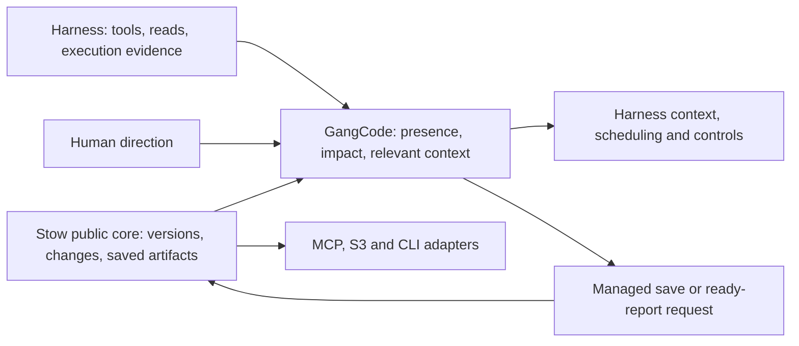

# Stow and GangCode product boundary

**Reviewed:** 2026-09-30 against the consolidated Stow plan, its accepted ADRs, the
current development source and GangCode's standalone repository. This is an
ownership and integration reference, not another implementation queue or a claim
that planned capabilities have shipped. Stow's [consolidated plan](storage-foundation-plan.md)
and [GangCode's plan](../../agent-collaboration/docs/plan.md) retain their work orders.

**Stow owns the durable, authorized storage facts and their delivery. GangCode owns
what those facts mean for people and agents, and how they coordinate their work.**
Existing harnesses execute agent turns and tools. GangCode integrates with those
harnesses; Stow neither runs them nor needs to understand a model conversation.

## Product definitions

Stow is portable working storage with version-aware admission, saved state,
retention, transfer and recovery. Its accepted expansion includes scoped access,
encrypted persistence and durable workspace notifications. It serves applications,
tests and transfer clients as well as agents.

GangCode is the shared-workspace awareness and coordination layer for agent
harnesses. It combines storage changes, native execution evidence and human
direction into relevant context, collaboration decisions and observable controls.
It is a reference example of extending Stow's core through public APIs, rather
than consuming Stow through MCP. Its agent-specific behavior stays in its own
repository and composes with the reusable storage foundation.
Presence, intentions and subscriptions help participants work together without file
claims. Neither awareness nor storage comparison proves semantic compatibility.

A capability belongs in Stow when its meaning is complete in terms of resources,
versions, permissions, storage operations and generic consumers. A capability
belongs in GangCode when it needs tasks, participants, agent reads, intentions,
conversation context or choices about further execution. This tests the contract,
not merely whether implementation code mentions an agent.

## Ownership

| Concern | Stow owns | GangCode or its host/harness owns |
| --- | --- | --- |
| Workspace and saved data | Files/objects, durable workspace identity, supported metadata, capture, diff, restore and transfer | Choosing workspace contents and which collaboration state to persist |
| Safe mutation | Qualified resource comparisons, save admission, conflict/effect outcomes and retained save resolution | Supplying the expected read identity, rereading, merging and deciding whether/how to retry |
| File observations | Generic content reconciliation, observed revisions, coverage gaps and durable storage journal | Native tool/activity/OTel observation, actor attribution evidence and agent read tracking |
| Notifications | Exact/parent/workspace subscriptions, bounded replay, delivery acceptance, immutable ready-output holds and optional webhook transport | Which agents care, why a change matters, context coalescing, delivery to model boundaries and adaptation evidence |
| Dependencies | Required storage/recovery dependencies, retained-data holds and admission against caller-declared input versions | Code/research/task dependencies, graph confidence, completeness of the declared basis and impact on active work |
| Readiness | Recording a caller's ready assertion, verifying supported declared storage conditions, freezing saved output and retaining it | Deciding work is ready, checking task/domain correctness and establishing writer quiescence |
| Presence and shared editing | Persisting selected document snapshots through public storage operations | Rooms, joins, cursors/read ranges, intentions, editor synchronization, patch rebasing and semantic conflict resolution |
| Recovery | Verified data and supported Stow-owned pending operations, retention, inactive adoption and qualified takeover | Task checkpoints, chosen context/progress schema, fresh harness admission and reconciliation of model/tool execution |
| Permissions and secrets | Enforcing supported storage policy and encryption at its access/admission boundary | Host authentication/key custody; harness tool/network/process permissions; participant identity is not a storage grant |
| Controls and execution | Storage handle lifecycle and explicit notification dispatch lifetime | Model selection, scheduling, steer/queue/interrupt, stop confirmation, provider credentials and sandbox enforcement |
| Product evaluation | Storage contract, transfer, retention and supported-profile evidence | Team effectiveness, time/spend, output quality, long-task persistence and blind human evaluation |

The resource ACL/encryption entries describe accepted target scope. They do not
upgrade current unscoped native profiles into implemented tenant security.

## Three different meanings of coordination

1. **Storage coordination:** one qualified admission gate prevents a stale managed
   save from replacing a newer resource. Stow owns it. It may use backend locks;
   these are not participant file claims.
2. **Document coordination:** concurrent operations converge, patches are rebased,
   selections update and edits preserve the document's logical revision. GangCode's
   document service owns this, if that profile is built. Stow can persist its output.
3. **Work coordination:** an agent notices a dependency changed, another participant
   is changing the same behavior, or a human has redirected the task. GangCode owns
   relevance and action; the harness executes the resulting turn/control.

Do not label successful storage comparison as compatible code, CRDT convergence as
correct behavior, or a notification receipt as model understanding.

## The integration seam

GangCode extends the public Stow core directly. MCP, S3 and CLI surfaces are
separate adapters to that core, not the integration layer between Stow and
GangCode. Extension means composing public core capabilities with application
behavior; it does not currently imply a runtime plugin loader or access to private
implementation packages.

Use a pinned public core artifact and explicit capability contracts. GangCode's
coordination logic remains independently testable with injected storage contracts.
Its existing ordinary-directory observer is prototype/fallback evidence. As Stow's
qualified notification capabilities become available, their journal becomes the
storage-change authority; GangCode must not maintain a competing authoritative
journal for those facts. Native harness evidence remains a separate source.

These are conceptual operations, not newly shipped API names:

- Read the profile's capabilities and limits before requesting stronger guarantees.
- Observe/replay resource changes and deduplicate by storage event identity; map
  storage identity explicitly to workspace paths and current participant interests.
- Persist consumer intake before acknowledging durable delivery. Separately verify
  and secure referenced immutable output before releasing its retention hold. Neither
  action implies a harness received the context or an agent used it.
- Keep harness acceptance, context serialization, provider consumption and useful
  adaptation as separate evidence. Model-boundary context remains bounded; a storage
  notification payload is not automatically a prompt.
- Route managed edits through Stow comparison where the profile supports it. On
  conflict, GangCode chooses the next read/merge/action. On uncertainty, retain the
  original request meaning and resolve it before starting a new mutation.
- Declare the input versions actually established by the caller when publishing
  ready output. Stow checks the declared basis within qualified admission; GangCode
  remains responsible for missing dependencies and reasoning correctness.
- Save selected portable collaboration state as ordinary versioned files/artifacts.
  Stow stores bytes and supported recovery dependencies; it does not interpret a
  task queue or implement a second agent execution registry.

Use Stow's typed notification contract when W08 ships, and its generated schema
where serialization is needed. Direct core composition does not require an MCP
or network round trip. GangCode may have its own
participant/control envelope, but must retain original storage event/version
identity and coverage rather than invent a competing definition of a storage change.
Storage scope matching and ACL enforcement remain core-owned; semantic relevance
filtering remains extension-owned. No SDK check-then-write supplies missing core
atomicity.

## What is available now

Stow's W02 native memory and owned filesystem profiles implement `ReadForSave`,
`SaveObject` and distinct committed/not-committed/unknown outcomes. The filesystem
profile adds bounded request receipts and reopen resolution. These operations are
available directly through the public Go package
`github.com/chester-hill-solutions/stow-s3/pkg/stow`; GangCode does not need the
native object MCP wrapper to use them. See the
[dated implementation evidence](implementation-2026-09-30.md).

That object directory uses object records. It is **not** the ordinary editable
workspace directory used by GangCode's native file tools. Workspace/custom-store,
WASM/in-process TypeScript and S3 exposure of the richer managed-save contract
remain unqualified. Existing JavaScript embedded bindings do not expose the richer
managed-save contract. A public binding can expose qualified core capabilities
without duplicating their implementation; choosing that binding or a Go composition
component does not require rewriting GangCode's harness/UI code. The public
`Store` interface supports backend extensions, but is not a general collaboration
plugin API. Do not treat multiple agents as permission to open independent owners
of the same directory.

Consequently, GangCode can exercise direct core saves for an appropriate artifact
use case now. Direct core integration alone does not make native
`write`/`edit`/`patch` calls conflict-safe. A code-edit profile needs an
explicit participating tool path and qualified workspace/document semantics.
Arbitrary host filesystem writers remain outside the current guard.

Durable notification APIs/schema (W08), ready reports/input-basis publication
(W09), diffs (W10), webhooks (W11), resource ACLs and encryption are not shipped by
the current native-save increment. GangCode's local observer and harness-context
work cannot advertise those future storage guarantees. Local evidence does not
certify Linux execution, cross-host takeover or a released artifact.

## Changes to the earlier split

GangCode's original boundary assigned observation and the collaboration journal
entirely to the collaboration product. Accepted Stow ADRs
[0014](adr/0014-storage-product-caller-owned-execution.md),
[0015](adr/0015-durable-workspace-notifications.md) and
[0016](adr/0016-scoped-access-encrypted-cache.md) now make that too broad:

- Move reusable content reconciliation, storage subscriptions, retained reports,
  storage delivery receipts/retries and artifact holds into Stow's core once their
  qualified implementations exist. Keep one implementation behind its wrappers.
- Retain native harness observation, participant state, agent-context assembly,
  decision lanes and execution/control receipts in GangCode. An application journal
  may persist them through Stow; its semantic ownership stays with GangCode.
- Treat stale-save admission and declared-input checks as storage primitives;
  keep conflict repair, dependency inference and readiness decisions in GangCode.
- Retain historical ADR snapshots/prototype copies as dated provenance. They are
  not the current authority for the expanded Stow boundary, and private source
  imports must not become the extension contract.

The next useful GangCode seam is direct composition with the existing qualified
core save APIs, followed by public observation/subscription APIs as W08 is
qualified. GangCode should demonstrate how an extension adds domain behavior
without duplicating storage machinery. Stow's separate MCP adoption work remains
in its consolidated queue; it is not a prerequisite for this integration.
Both products remain independently testable. GangCode integrates with existing
harnesses through their qualified context and control hooks.
