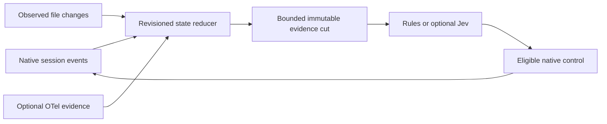
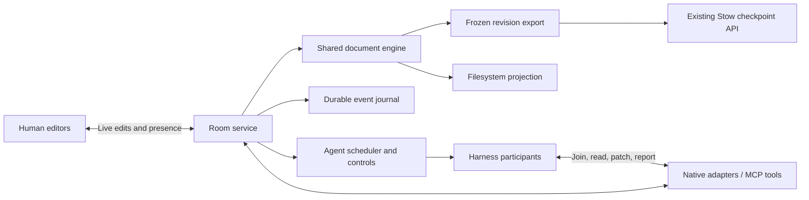

# Realtime multiplayer engineering detail

> **Transferred to the standalone Agent Collaboration repository on 2026-09-29.**
> The retained body below is dated handover/review history, not Stow's active backlog.
> Current scope, implementation status and evidence live in the
> [collaboration plan](../../agent-collaboration/docs/plan.md) and
> [capability record](../../agent-collaboration/docs/CAPABILITIES.md).
> Stow remains an optional public storage integration. No remote repository has been created.

**Date:** 2026-09-29, America/Toronto. **Status:** proposed implementation detail
for the [product plan](realtime-multiplayer-plan.md). These are supporting implementation
notes, not the definition of product success. This document schedules no
package release or hosted service. [The canonical plan](plan.md) tracks its RT
work items; [ADR 0014](adr/0014-storage-product-caller-owned-execution.md) still
places execution and collaboration in the caller, with Stow owning storage.

## 1. Product contract

A file is a shared room. People and agents can join it, work in it simultaneously,
and receive relevant changes without receiving every other participant's context.
Presence describes activity; it grants no ownership or exclusive editing rights.

The user has established these requirements:

- No file claims, reservations, ownership handoffs or waiting for another editor
  to release a file. Multiple people and agents can edit the same file.
- Joining delivers who is already there and each participant's last cursor
  location as the first application message, before subsequent file events.
- Agents' cursors mean their last read/edit range, explicitly labelled; human
  cursors mean caret/selection. Unknown locations remain unknown.
- Steer, queue and interrupt are distinct actions. Steer reaches active execution,
  queue adds later work, and interrupt stops current work while retaining edits.
- Presence, edits and control receipts respond immediately through ordinary code;
  model latency does not determine the room's responsiveness.
- Agents receive only their joined/subscribed file events. Model work is triggered
  by relevant actionable changes, not by every cursor movement or keystroke.
- Dependency changes reach affected work with causal provenance, impact scope,
  graph freshness/confidence and the revisions the agent actually relied on. A message
  from a dependency is evidence to evaluate, not authority to change another task.
- Git worktrees are not the user-facing coordination model. Stow checkpoints are
  recoverable saved state, not editing locks or evidence of task correctness.

**Later shared-edit completion scenario:** two independently identified browser participants
and two real agents join the same text file. OpenCode is the initial proven runner;
qualification then repeats the scenario with OpenCode plus Codex or Pi through native
adapters. Each agent receives presence
first, including the other participants' last locations. Both browsers and agents
make overlapping edits; everyone converges on the same document. A person steers
one active agent, queues another task and interrupts the other agent. Unrelated
files cause no model turn. Reconnection and a checkpoint restore preserve confirmed
edits and task/report state without reviving historical presence. Completed receipts
prevent unnecessary replay; uncertain model execution requires reconciliation.
ChatGPT/tool-only host acceptance is tracked separately from active-runner acceptance.

**First delivery:** two real OpenCode agents keep their native workspace workflow while
an observer maintains current activity/file state and records shadow decisions. RT-1
qualifies awareness and bounded steering before editor infrastructure. The observer
profile cannot prevent native overwrites or fence a process's filesystem writes. The
guarded-edit scenario above remains the RT-2–RT-4 expansion contract.

## 2. What exists and what must change

The [first experiment](../examples/multiplayer-prototype/NOTES.md) demonstrated
three overlapping OpenCode admissions, selective reports, controlled interruption,
fresh-session resumption, reused-session continuation and byte-equivalent local
checkpoint restoration. It did not demonstrate shared-document editing, human
participants, within-turn steering or coordinator-crash recovery.

| Existing touchpoint | Reuse | Change for realtime |
| --- | --- | --- |
| `examples/multiplayer-prototype/room.mjs` | Participant IDs, subscription matching, report identity and explicit acknowledgment semantics | Remove claims from the new protocol; replace full history scans and one-JSON-file-per-report hot path with indexed room state and a journal |
| `examples/multiplayer-prototype/coordinator.mjs` | Dedicated agent state, scoped credentials, one execution per agent, cancellation/confirmed process stop | Add native observation and bounded scheduling first; replace output ownership in the new profile; checked document tools follow in RT-2 |
| `examples/multiplayer-prototype/dashboard.mjs` | Read-only evidence rendering and artifact confinement | Push truthful awareness/control evidence first; shared editor follows in RT-2 |
| `examples/multiplayer-prototype/demo.mjs` | Independent outcome checks and actual admission overlap evidence | New scenario uses two browser clients and two agents editing one document |
| `examples/opencode/opencode.mjs` | Authenticated local requests, admission identity, session reuse and terminal checks | Add a separate collaboration adapter/profile; the existing file-only caller keeps its current behavior |
| `examples/opencode/server.mjs`, `local-store.mjs` | Dedicated HOME/XDG state, exact runtime pin, state admission and atomic small configuration writes | Replace blocking per-start version probing with async/cached verification; do not use atomic JSON replacement as a growing event database |
| `packages/stow-s3/src/workspace.ts`, `examples/opencode/native-storage.mjs`, `controller.mjs` | Prepare/serve, capture request keys, publication reconciliation, restore, bounded retry | Capture an immutable collaboration revision through existing storage operations |

Keep the first experiment intact as dated evidence. Build the new product/spike in
a separate collaboration repository under the [repository boundary](realtime-repository-boundary.md).
Port applicable caller primitives with provenance and independent tests, removing
private Stow path imports. Its core observation loop works without Stow; the optional
storage adapter uses documented exports/CLI. Establishing a repository does not imply
package publication. Do not put a scheduler or editor API into the storage package.

## 3. Architecture and initial choices

Start with one workspace host and a caller-owned observer/state service. Native session
events and confirmed file observations feed a reducer; OTel optionally enriches them.
Code continuously listens, coalesces causes and builds immutable evidence cuts. Rules
or optional Jev evaluate actionable cuts, then an eligible adapter delivers the chosen
control and observes the response. No model call is needed to maintain presence/state.



The later guarded-edit profile adds one authoritative document service and browser
participants. Distributed leadership and cross-host editing remain deferred. Its event
sequencer orders small operations; it does not reserve documents for participants.



Proposed guarded-edit stack, to be pinned and measured when RT-2 begins:

- Node service matching the existing example runtime, with a persistent WebSocket
  connection per browser/agent transport. Keep transport framing separate from room
  semantics; use a maintained WebSocket implementation rather than hand-written frames.
- CodeMirror 6 as the browser code editor, with Yjs `Y.Text` and a pinned compatible
  [CodeMirror binding](https://github.com/yjs/y-codemirror.next). Select stable versions
  as a pair; repository main may target another major. The binding connects shared
  text and cursor awareness; keep the UI shell thin.
- Yjs document updates for text synchronization and relative positions for stable
  locations. Updates support incremental synchronization and state-vector recovery;
  do not invent a text merge algorithm. See [document updates](https://docs.yjs.dev/api/document-updates)
  and [relative positions](https://docs.yjs.dev/api/relative-positions).
- Awareness for live presence, plus a separate bounded last-location record. Yjs
  awareness is transient and removes offline clients, so it cannot alone meet the
  historical-cursor requirement. See [awareness](https://docs.yjs.dev/api/about-awareness).
- A local SQLite journal through a runtime-compatible supported driver, with one
  writer, transactional sequence allocation and a tested durable configuration.
  Driver selection, Node compatibility, cancellation and latency are RT-2 checks.

**Language boundary:** Stow's storage implementation stays in Go; no rewrite is
proposed. Node/JavaScript/TypeScript is the initial collaboration-spike candidate
because it reuses the existing caller and shares one document implementation with
the browser. RT-0 uses the existing caller runtime. If RT-2 measurements justify another
server language, compare a Go room hosting an interoperable document engine/worker:
correctness, latency, memory,
process supervision, packaging and maintenance. A native Go document implementation
must prove synchronization/anchor interoperability; a Go service with a JS worker adds
a boundary to qualify, not a presumed performance improvement. Choose one path and
record why rather than building two production servers.

**Wire format:** Protobuf is the preferred candidate for typed room envelopes,
presence deltas, controls and receipts; compare it with JSON and a compact binary
alternative against the RT-2 workload before locking the choice. Use generated Go/TypeScript codecs
and native byte fields for document updates, with no base64 on the room hot path.
Protobuf's tagged fields and binary bytes are documented in its
[wire format](https://protobuf.dev/programming-guides/encoding/); this does not prove
an end-to-end speedup for this workload. Measure encode/decode latency, allocations,
wire size, browser bundle/startup cost and p95/p99 room latency with identical payloads.
Keep upstream MCP/app-server JSON-RPC at the adapter boundary; adopting Protobuf
internally does not require replacing harness protocols or using gRPC in browsers.

Define schema version negotiation, reserved field numbers, integer precision in JS,
unknown-field behavior and bounded decoding. Never derive idempotency equality from
arbitrary serialized bytes: Protobuf serialization is
[not canonical](https://protobuf.dev/programming-guides/serialization-not-canonical/).
Specify a versioned semantic payload hash independently. Keep a readable diagnostic
decoder, avoiding a second authoritative JSON protocol. The observer may initially use
bounded versioned JSON records; it need not build three encodings before a value test.

In guarded editing, use one document per file and load inactive files lazily. A workspace has stable
file IDs and a path map; room/file sequence numbers are distinct from Yjs state
vectors. The authoritative document engine owns live text; the filesystem is its
projection for ordinary read-only consumers. Agents and editors mutate documents
through the room, not through independent whole-file writes.

Observer mode confirms bounded UTF-8 file content/hash observations in declared paths,
using a baseline scan, native events, a filesystem watcher and bounded reconciliation.
Watchers may coalesce intermediate writes; an observed revision is not a durable receipt
for every native edit. Filesystem bytes establish content, not authorship, read basis or
an atomic multi-file cut. Missing correlation remains unknown. Native external writes
are normal in this profile and generate observations rather than projection conflicts.
Use incremental path work; full workspace hashing belongs to initial/reconciliation
scans, not every event. Symlink/path confinement follows the existing caller boundaries.

Switching to guarded authority requires quiescing native writers, importing a verified
baseline and changing adapters before reopening admission. Never run two authoritative
writers or silently import watcher output into live CRDT text. Initial guarded scope
is UTF-8 text in declared workspace paths. Binary live editing,
arbitrary terminal writers, rename/delete during active editing, unattended hosted
agents and offline agent execution are outside the first completion scenario.
Reject unsupported operations explicitly; do not silently import them into live text.

## 4. Join, presence and cursor contract

Presence also includes a bounded current task/intention, for example “changing empty-name
validation,” linked to the active execution and its last confirmed read/edit ranges.
An intention is self-reported descriptive context, not verified ownership or an editing
reservation. Publish changes when direction changes; expire active intentions when the
execution settles or its heartbeat is stale. Include these fields in the first join
snapshot so participants understand both who is present and what they are doing.
The product acceptance in [the main plan](realtime-multiplayer-plan.md) governs whether
this awareness actually reduces conflicting work.

### Ordered join

`joinFile(fileId, participantSession)` executes these steps in the room sequencer:

1. Authenticate the participant and validate workspace/path access.
2. Obtain the active file's cached participant state and document revision.
3. Record a live barrier sequence `S` and immutable document sync bytes/state for that
   revision. Install the subscriber with a bounded outgoing buffer and enqueue
   `file.joined` as its first application event. Snapshot existing participants before
   adding the new session, so the payload answers who was already there.
4. Send `document.snapshot` for exactly that frozen revision, then
   `file.sync.complete(S)`, then subsequent events after `S` in order. Buffer this subscriber's events while its
   initial synchronization is pending; do not stall the rest of the room.
5. Announce the new participant to existing subscribers. No model call is involved.

Guarantee this ordering separately for every joined file. Enable local editing/agent
patches only after that file's sync-complete marker. Cold loading and socket sends run
outside the sequencer; never encode a later mutable document as its barrier snapshot.

Transport authentication/handshake frames may precede the snapshot; no file edit,
report or agent tool result may precede its first semantic join message. For an agent,
`join_file` returns this snapshot before any content read. Auto-joining on first read
must preserve the same ordering and expose the snapshot first in the tool result.

Proposed example, not an implemented API:

```json
{
  "type": "file.joined",
  "protocolVersion": 1,
  "fileId": "file_cart",
  "path": "src/cart.ts",
  "serverEpoch": "epoch_7",
  "throughSequence": 184,
  "durableThroughSequence": 151,
  "documentRevision": 63,
  "participants": [
    {
      "participantId": "alice",
      "sessionId": "browser_1",
      "kind": "human",
      "presence": "active",
      "lastLocation": {
        "kind": "selection",
        "line": 42,
        "column": 8,
        "observedAt": "2026-09-29T20:00:00Z",
        "basisRevision": 63,
        "resolvedAtRevision": 63,
        "anchor": "opaque-relative-position"
      }
    }
  ],
  "recentParticipants": [],
  "cursor": "epoch_7:184"
}
```

### Presence semantics

- Identify a person/agent separately from its connection/session. Two tabs belonging
  to one person have separate sessions and locations; reconnecting does not create
  duplicate active memberships. Agent generations likewise have separate sessions.
- Human selections use relative anchors and direction. Agents publish last read/edit
  ranges when their adapter actually performs a tool operation. Do not infer agent
  location from generated text or claim a caret exists where none was observed.
- Store the observation revision and timestamp; resolve anchors against current text
  for display. If resolution fails, show an unavailable/stale location with its old
  revision, rather than displaying an incorrect current line number.
- Joining with no prior location reports `lastLocation: null`. Heartbeats describe
  live connectivity; explicit disconnect marks offline immediately, missed heartbeats
  expire presence. Default heartbeat/expiry settings are measured in RT-0.
- Persist only the latest useful last-location state periodically and on clean leave.
  Crash recovery may show an older timestamp. Keep disconnected participants in a
  separate bounded recent list, initially ten entries for fifteen minutes per file.
  They never appear as actively connected after restart.
- Join snapshot contains current participants and the bounded recent list. The initial
  supported room cap makes this payload bounded without hiding active participants.

## 5. Concurrent editing without claims

Human editor clients emit incremental document changes and render optimistic local
edits. The room attributes accepted operations to authenticated sessions, sequences
them, journals them and broadcasts them. CRDT convergence means clients can agree on
text; it does not establish that two code changes are semantically compatible.

Agents require a different write interface because a model often edits an older read:

1. `read_file` returns a read ID, revision and requested text/ranges; the room retains
   a bounded read basis and relative anchors for that agent. It also updates presence.
2. `patch_file` submits an operation ID, execution generation, read ID and replacement
   ranges with expected old text. Resolve those ranges against the current document.
3. Validate all expected ranges immediately before one transaction. Accept unrelated
   intervening edits; refuse the patch if its target text was changed/deleted or its
   anchors/read basis expired. Retain bounded indexed edit history since each read:
   delete/reinsert and edit/revert of the target count as conflicts even if its text
   matches again. Same-gap concurrent insertion is a conflict for agent patches;
   human CRDT insertions retain their merge ordering. Specify boundary association
   and transform ranges through intervening edits. Validate relevant upstream read
   bases as described in §6, even if the destination text is unchanged. Return current
   relevant text and a conflict event when any precondition fails.
4. Prevalidate all bounded, non-overlapping ranges, document/admission epoch, generation,
   dependency read set and read ID together. Stage the candidate update without changing
   authoritative text, applying replacements in descending range order. Commit candidate
   and receipt before authoritative apply/broadcast. Final validation/candidate creation
   have one mutation admission point without an asynchronous race. A Yjs transaction
   batches changes; it is not a database rollback mechanism. Publish a
   correlated operation receipt and update the agent's last edit range.
5. The agent replans only the conflicting portion. A conflict grants nobody ownership.

Bind guarded reads and proposed patches to an adapter-issued context token containing
task ID/revision, execution generation, instruction revision and model-step/context ID.
Accepted human steering immediately supersedes automatic decisions and closes affected
old-context mutation admission; delivery establishes the next eligible context. Pending
steering is not yet incorporated instruction. Revalidate the token with every patch at
the same admission point as its read basis. An old step cannot commit merely because
code and execution generation stayed unchanged. Observer mode cannot enforce this token
on native writes and must display that limitation.

Whole-file replacement is permitted only for creating an absent file or an unchanged
read basis. It is refused when it would erase another participant's intervening work.
Multi-file atomic transactions are deferred; UI and reports state partial outcomes.
Concurrent human edits can still make invalid code; highlight concurrent affected
ranges and show language diagnostics without pretending to understand intent.

Maintain per-author undo through [Yjs UndoManager](https://docs.yjs.dev/api/undo-manager)
with adapter-bound participant origins. Its initial stack is runtime-only; undo across
restart is a separately verified capability. Interrupt does not
undo anything. A later undo/restore is an attributed edit against current state;
restoring an entire old workspace over other participants' edits is not a control action.

Filesystem projection serializes atomic file replacements from accepted text versions
and records its revision watermark. Builds/tests may run in a read-only snapshot of
that watermark. Unexpected direct filesystem writes produce a visible external-write
conflict; they do not silently become authoritative edits. Arbitrary process writers
need a separate adapter/sandbox design before admission.

## 6. Live events and selective agent awareness

Keep three distinct event classes:

| Class | Examples | Handling |
| --- | --- | --- |
| Live presence | Join/leave, caret/selection, last read range | Small in-memory updates; intermediate cursor movements may be coalesced |
| Durable work | Document operations, reports, task/control receipts | Ordered journal, operation IDs and replay; acknowledged edits cannot be dropped |
| Agent notifications | Relevant edit batches and explanations | Indexed inboxes; compact context supplied at actual execution boundaries |

Sequencing domains are explicit: a durable workspace journal sequence for confirmed
work, a file revision for document operations, and an epoch-local live sequence for
presence/delivery ordering. `throughSequence` is the live join barrier;
`durableThroughSequence` is the journal watermark. Yjs state vectors synchronize text,
not reports/controls/receipts. Presence gaps never trigger durable replay. Authenticate
who submitted an operation; a CRDT update may contain learned peer structures, so its
transport sender is not necessarily the author of every included change. Reports refer
to accepted-operation receipts with authenticated submitters.

Joining a file installs its presence/edit subscription. Optional explicit directory
subscriptions install bounded background interests without pretending the agent is
actively in every file. Leaving removes live membership; acknowledged/delivered history
remains governed by journal retention. New subscriptions receive current state and
future events, plus a bounded catch-up summary on explicit request.

Agent explanations reference accepted operation IDs and revision ranges. Live edit
notifications need not wait for a prose explanation; reports arrive when the agent has
one to supply. Prevent fabricated attribution by verifying those references. Technical
transport receipts are distinct from an agent saying it understood or applied a report.

Use per-file subscriber indexes and per-agent pending inboxes. Do not scan all reports
to notify one subscriber. Coalesce adjacent agent notifications into a compact range
of revisions with changed ranges and report references; retain the full edit journal.
Human cursor traffic causes zero model calls. Ordinary edit events enqueue immediately;
idle-agent wakeups use a short configurable debounce, initially 100–250 ms, a budget
and task relevance rules. Busy agents accumulate context without starting a second run.

Prevent automatic response chains with originating operation IDs, self-event exclusion,
deduplication, bounded automatic follow-ups and visible budgets. An agent running out of
budget pauses automatic reactions while leaving the room and human controls responsive.
An unrelated file must neither enter its prompt nor trigger its model.

### Work overlap and changes in progress

Include task intent and the outcome being changed in overlap notifications. Agents
inspect current evidence, revise stale proposals or record voluntary next-action
agreements. An agreement has participants, cause/revision references and expiry; it
confers no ownership and cannot gate another participant's access. Revalidate it when
the cause or task changes. Initial negotiation cap: two clarification rounds, at most
four participant replies per unresolved cause, within the task/time budget. Then pause
only the affected mutation/task and emit one actionable human decision. Deduplicate
reciprocal messages by cause; silence is never an acknowledgment. Human controls retain
priority. Completed tasks require authorized follow-up scope or new queue admission
before another execution; notifications cannot silently reactivate them.

Attach optional bounded change-group IDs to operation receipts and reports. Caller-owned
group state is in-progress, ready or abandoned; it records intended outcomes, participant
contributions, exact affected revisions and validation receipts. Ready is a declaration,
not an atomic multi-file commit or verified correctness. Checks execute against immutable
revision cuts and become stale when relevant inputs change. Consumers verify current
dependencies even after a ready event. Producer disconnect marks uncertainty without
locking files; partial accepted edits remain durable. Version these caller payloads and
bound retention; no Stow schema extension or new core transaction API is required.

Groups have monotonically versioned manifests naming required files/revisions and
contributions. Ready/abandoned declarations authenticate the declarant and compare the
expected group version. Later relevant edits invalidate effective readiness and current
check status automatically. Check receipts name the immutable input manifest, recipe
version and relevant configuration. A delayed old ready/check result remains historical;
it cannot clear current refresh requirements. Observer checks require a separately
frozen fixture/export, not an assertion that sequential file reads were atomic.

### Continuous observation, decision and actuation contract

These are proposed caller contracts, shared by observer and guarded profiles:

1. **Ingest and reconcile.** Version observations with source/session/generation IDs,
   source event ID/sequence when supplied, receive time, effective/source time, coverage
   and correlation strength. Source order, local ingestion order and document revisions
   are different coordinates; timestamps alone do not establish cross-source causality.
   Native cursors resume exclusive-after where supported. Gaps, watcher overflow or
   process restart mark coverage dirty and trigger bounded rescan/catch-up. A new observer
   epoch rejects late prior-epoch actions. Do not invent missing source sequence/ranges.
2. **Reduce current state.** Confirmed native receipts own task/control lifecycle;
   confirmed filesystem observations own observed content; guarded receipts own accepted
   edits. OTel contributes labelled activity/usage evidence only. Late/duplicate old-run
   observations cannot regress state, revive intentions, clear inboxes, advance verified
   read watermarks or declare a replacement idle. Deduplicate cross-source reports only
   with verified correlation; path/time similarity remains weak evidence.
3. **Capture evidence.** Freeze a bounded cut with a semantic digest, canonical cause IDs,
   task/goal revision, declared intention revision/expiry, human instruction revision,
   execution/context identity, relevant file/read bases, graph coverage/version and
   change-group manifests. Label missing facts and field ages. The cut is coherent
   decision evidence, not a claim that independently observed native files were atomic.
4. **Admit decisions.** Initially one evaluation in flight per active task and one pending
   coalesced dirty cut; no model polling of unchanged state. Deduplicate by task/cause,
   evidence digest and policy/question/model version. Ignore presence-only/known unrelated
   changes; uncertain impact cannot be labelled definitely irrelevant. Priority human
   controls bypass debounce. Freeze deadlines (including SDK retries), inference/usage
   budgets, notification cooldown and maximum wait from the pilot before qualification.
   Under sustained edits, expiry yields normal awareness/uncertainty rather than an
   indefinitely delayed confident decision. Rules and freshness guards run independently.
5. **Compose and admit actions.** Validate typed question-keyed responses and compose
   independent answers deterministically. Contradictory/invalid combinations become
   insufficient evidence. Recheck the evidence/context token, authorized task scope,
   graph/group basis and newer human direction at action admission. Supersede stale work;
   do not let a late classifier response override a same-generation human steer.
6. **Observe and recover.** Persist decision identity/status and correlated control ID
   before actuation; record proposed, shadow-only, admitted, superseded, failed/unknown
   and settled outcomes. Reconcile an existing native inbox/control receipt after a lost
   reply or crash before retrying the same semantic command. If admission cannot be
   determined, keep unknown and do not submit a fresh restart/interrupt ID. Controller
   events do not trigger themselves, but their correlated results still update state.
   Distinguish routing, durable acceptance, runtime-context delivery, model consideration
   self-report, verified refresh and independently observed adaptation.

Initial action catalog and authority:

| Action | Operational mapping / eligibility |
| --- | --- |
| `no_action` | Preserve state; never clear an unresolved stale basis by classifier assertion |
| `notify` | Deliver a bounded cause/evidence bundle to the active participant or show it in the UI |
| `refresh_context` | Request reread/validation of named affected facts at a verified boundary; require evidence before recording refreshed |
| `steer_current_task` | Use a fixed template plus evidence references within the assigned goal; require verified live session/task, fresh cut and qualified native delivery |
| `ask_human` | Show one scoped unresolved choice; pause only affected automatic work where enforceable |

Modes advance separately: shadow records only; advisory delivers observations or displays
suggestions; scoped automatic steering requires comparative benefit and proven receipts.
Automatic interruption, new tasks and scope expansion are disabled initially. Unknown
native identity, stale evidence or unsupported delivery prevents actuation. Peer prose
cannot authorize a control. Human interrupt/queue capabilities are qualified separately.

Initial observer bounds are proposed experiment defaults: at most two classifier calls
in flight workspace-wide, one per task; one latest pending cut per task; 64 KiB/100 causes
per cut; and 1,000 records/1 MiB queued per source. Validate decoded record limits before
retention. Overflow/truncation marks coverage incomplete and invokes reconciliation or
normal awareness fallback; it cannot silently certify an unaffected task. Never drop a
guarded accepted operation to meet an observation budget. Include total workspace
admission and inference usage limits in the pilot profile; record revised frozen bounds
before qualification. This prevents per-task caps from multiplying into unbounded load.

### Dependency impact and message interpretation

**Optional decision experiment — Jev:** TypeSafe's
[official introduction](https://docs.typesafe.ai/introduction) describes Choice, Score
and Noul questions over a supplied state; questions are evaluated independently and
the model returns structured answers, not generated prose. Prefer atomic questions
about relevance or incompatible outcomes and compose the control policy in code.
Choice/Score confidence is derived from the answer distribution; do not equate it
with a measured probability of correctness on our task. See
[confidence semantics](https://docs.typesafe.ai/confidence).

Filter known irrelevant/self/duplicate events before inference. Give the classifier a
bounded evidence bundle and an explicit insufficient-evidence choice, with authoritative
IDs/revisions and peer prose labelled separately. Generate steering from a finite action
catalog and evidence references, not invented Jev explanations. It proposes actions
within existing task scope; it cannot grant permissions or author patches. Validate
the full context/evidence token above again before applying any delayed decision.
Invalid answers, expired evidence, timeout or unavailable service retain normal awareness
and checked-write behavior. Presence/edit/control receipts never wait for inference.

Run in observation-only mode first on sanitized fixture states. Record proposed action,
question/model versions, distributions, source evidence and decision latency. Benchmark
rules/awareness alone versus Jev-assisted steering; qualify reread/notification before
automatic interruption. Choose thresholds from held-out conflict/no-conflict cases and
measure unnecessary interruptions, missed conflicts and sustained response loops.
Record the actual returned model identity rather than assuming a moving alias is fixed.
Provider use and external workspace-context transmission are separately configured;
planning adds no service dependency or model call. Published vendor speed/cost figures
are not acceptance evidence for our end-to-end workload.

A file room also carries relevant changes from its upstream dependencies. Explicit
joined-file interests and dependency-derived interests are distinct: the latter
deliver impact without pretending the participant is currently editing that dependency.

`dependency-graph.mjs` maintains versioned producer → consumer edges and reverse indexes.
Begin with task-declared edges (for example, metrics JSON → dashboard) and parsed JS/TS
imports, re-exports and configured module resolution. Reuse TypeScript's parser/resolver,
declared and locked in the collaboration repository; do not use import regexes or import another
package's development dependency at runtime. Track type-only edges, aliases, unresolved
imports and dynamic imports explicitly. Data schemas, templates, generated outputs and
cross-language links need declared/adapted edges until their extractor is implemented.

Every edge records its kind, source revision, extraction method and confidence. Graph
coverage is never described as complete merely because ordinary imports resolved.
Parse edited files incrementally in a worker with bounded debounce. During an incomplete
edit or parse failure retain last-known edges as stale, flag uncertainty and refresh
before treating a result as definitely unaffected. Edge additions/removals update
subscriptions and invalidate derived impact work; avoid dangling interests after leave.

Track graph dirtiness and processed-through source/configuration revisions. After parsing,
reconcile newly discovered edges against producer-change watermarks and enqueue causes
missed while the edge was absent. Alias/package/resolver changes invalidate their affected
resolution scopes even if consumer text did not change. A dirty/incomplete graph cannot
certify unaffected work: guarded admission refreshes or returns scoped uncertainty;
observer mode warns without claiming prevention. Retaining last-known edges alone does
not cover newly introduced dependencies.

Classify changes into text-only/unknown, implementation, exported contract/schema,
configuration/build and package dependency changes. Parser/type/schema evidence and
agent explanations are separate inputs; an agent's claim that a change is harmless
does not suppress contradictory structural evidence. Source-code dependency edges do
not imply every edit is a breaking API change. Comments/cursors do not automatically
wake every transitive consumer.

For an upstream change, enqueue one causal impact bundle for affected subscribers:
changed producer IDs/revisions and operation IDs, graph revision/confidence, dependency
paths to their work, affected symbols/contracts where known, report references and
whether relevant read bases became stale. Walk reverse edges with visited sets, bounded
depth/fanout and strongly connected component handling. Deduplicate diamond paths and
cycles by cause ID; if traversal is capped, report incomplete impact explicitly and
perform a bounded background assessment instead of flooding every model.

Agent decision policy:

| Dependency message | Agent consideration |
| --- | --- |
| Cursor/presence or verified irrelevant range | Update room state; no model call |
| Compatible implementation change outside facts used by the task | Batch context, continue with current validated read bases |
| Exported contract/schema or referenced symbol changed | Mark affected work stale, refresh dependency reads and replan the affected portion |
| Graph stale, unresolved edge or uncertain impact | Re-read relevant sources/refresh graph; show uncertainty instead of claiming safe continuation |
| Package/configuration/lockfile changed | Evaluate the affected resolver/build scope once per causal batch; do not install packages or execute scripts solely because a peer suggested it |
| Peer report disagrees with observed document/schema | Inspect its operation/revision evidence, retain both sources and surface the disagreement |

Treat peer prose as untrusted context within the task's existing authority. Inspect
who reported it, whether its referenced edits were accepted, whether those revisions
are current and which fact it changes. A report may recommend work; only an authorized
control action changes task direction or grants capabilities. Human steer/interrupt
outranks automatic dependency reactions.

`read_file` records a bounded relevant read set for the task: document epochs/revisions,
read ranges or contract fingerprints and dependency graph basis. `patch_file` rechecks
that set at mutation admission. A changed upstream fact can refuse the patch even when
the target file has not changed. Accept unchanged facts after verified refresh rather
than demanding that every unrelated upstream byte remain unchanged. If relevance cannot
be established, use conservative revision checks and return `stale_dependency_context`.
No dependency is locked; other participants continue editing during this assessment.

Register admitted/injected workspace context as revision-linked task inputs too, including
dependency summaries and relevant inherited session reads. Unknown inherited bases stay
unknown and require refresh before affected guarded patches; a new task's empty read
set does not erase earlier assumptions. Model `considered/continue` self-report does not
clear stale guards: require a mediated read or deterministic fingerprint validation at
the relevant revision. Protection covers recorded assumptions; coverage is visible.

Inbox/application receipts include `consideredThroughRevision` per dependency and the
action taken: continue, re-read, replan or defer. New dependency events arriving during
generation remain pending until considered; receipt of a report never marks them handled.
Repeated bursts coalesce by producer/revision/cause, while intermediate durable edits
remain in the journal. Pending context/read-set limits and automatic reaction budgets
prevent dependency churn from growing prompts or creating agent-to-agent loops.

Join snapshots include compact dependency status: graph revision, relevant stale read
bases and pending causal IDs. Detailed dependency reports follow the first presence
message. Agents receive participant locations first without a graph traversal/model call
on the join path; cached graph evidence may be explicitly stale.

## 7. Steer, queue, interrupt and pause

Each agent has a task inbox, an active execution generation and a priority control
mailbox. Control commands are idempotent and tied to a specific target generation
where applicable. They are not delayed behind model notification debounce.

| Action | Required behavior |
| --- | --- |
| Steer | Persist a new direction for the active task and deliver through a verified active-step boundary before the original task becomes idle. Use interrupt/resume or confirmed restart when immediate preemption is requested or boundary delivery fails. Retain accepted edits and task identity. |
| Queue | Persist a separate task. Start after the current task settles; permit reorder/edit/cancel of pending items. Existing task continues. |
| Interrupt | Invalidate that generation's future tool writes immediately, request cancellation, wait for confirmed settlement, then show interrupted with accepted partial work. Starting its successor requires settlement of the previous run. |
| Pause after task | Finish current task, then disable automatic starts until resumed. |
| Pause room | Stop automatic task admission and apply a chosen pause policy to active agents. Human presence/editing remains available. An export requiring a frozen revision uses the snapshot mechanism, not this control. |

State transitions include `idle → running → steering/stopping → idle/interrupted`,
with `stop-unconfirmed` when cancellation cannot be verified. Queue edits operate
independently of execution. A late command for an obsolete generation returns a stale
target receipt; it cannot accidentally interrupt the next task. Repeated steer commands
may supersede older pending directions while preserving their receipts.

UI shows separate `received`, `accepted`, `applied` or `failed/superseded` receipts.
Received means the room saw the request; accepted means its command is durable.
Steer delivery correlates room command ID → runtime inbox ID → `InboxDelivered` →
subsequent generation/context consuming it; actual adaptation is verified separately.
Restart admission is labelled `restart admitted`, not instruction applied.
An interrupt is applied only after fencing and confirmed settlement.
Interruption displays `stopping` until verified, never `stopped` on HTTP cancellation
alone. A delayed model cannot make the send control look unresponsive.

The UI labels unknown/stale locations, optimistic/durable edits, queued/delivered
instructions, stopping/settled interruption, conflicts, budget pause and export lag.
User-journey checks cover these visible states, not instrumentation alone.

Generation tokens are checked by every mutating agent route, including reports and
agent-accessible generic document updates, at mutation admission rather than request
arrival alone. Interrupt immediately revokes admission in memory, then journals the
control and requests cancellation. Already-admitted operations may finish committing;
later ones fail. Record and test that linearization point. Other participants continue
editing. Human steer acceptance increments the authoritative direction revision and
supersedes older automatic decisions immediately; record delivered context revision
separately. Native boundary steering need not replace the execution generation. Guarded
old-context writes remain ineligible until a verified new context is admitted. Observer
mode requests native stop but cannot promise immediate filesystem fencing. Neither
mechanism reserves a file.

## 8. Harness adapters and capability checks

The caller observation/room/document/dependency/control protocol is harness-neutral. OpenCode,
Codex/ChatGPT, Pi and other common harnesses connect through adapters and the same
tools. Each adapter maps native session/task/events to room identities, receipts
and generations. There is one caller task scheduler, not a parallel queue per harness.

Common tools: `join_file`, `read_file`, `patch_file`, `leave_file`, `set_intention`, `publish_report`,
`read_inbox` and bounded dependency-impact queries. Offer a versioned MCP server for
portable tool access and an SDK for native extensions. Bind participant/generation
identity at the authenticated adapter, not from model-supplied fields. Tool access
alone does not establish background event delivery or active steering.

`set_intention` (or a verified equivalent adapter hook) is authenticated and bounded;
carry task/instruction revision, monotonically versioned declaration, timestamp/expiry
and source. Assigned goal, active declaration and inferred recent activity are separate
fields. Queued tasks cannot replace active intention; undelivered steering is pending;
absent declarations remain unknown. A late span cannot revive an expired declaration.
A first-awareness snapshot must preserve these distinctions. Explicit joins/pre-read
hooks prove presence-first delivery; observing a finished read does not prove it.

Adapters declare and prove capabilities: mediated reads/writes, first-join presence,
live inbound events/context injection, native boundary steering, immediate preemption,
caller-queue admission, generation-specific settlement, session continuation and
execution fencing. Unsupported controls are visibly unavailable or explicitly labelled
restart-based; a prompt file or passive watcher is not full realtime participation.

### OpenCode: extend the verified local caller

The existing adapter proves prompt admission/session reuse and terminal checking.
HTTP wait cancellation alone does not stop execution; the prototype closes its
dedicated process. Its `execute()` footer requests native notes/progress writes and
its validator rejects unfamiliar tools. Extract request/admission/terminal primitives;
retain native writing for the observer profile, adding bounded awareness/intention
hooks. The guarded profile later provides mediated tools and an execution-time
allowlist; preserve the old footer/profile for the original caller.

Planning review verified twenty recorded source hashes for pinned v2.0.16 commit
`3a103fe0aff726a4edc7492f03f7b88195d9e4c9`. Static source contains native steer/queue
and interruption; RT-0/RT-1 must prove the observation/delivery used, while full queue/stop
qualification remains RT-4. References:
[session protocol](https://github.com/anomalyco/opencode/blob/3a103fe0aff726a4edc7492f03f7b88195d9e4c9/packages/protocol/src/groups/session.ts),
[inbox promotion](https://github.com/anomalyco/opencode/blob/3a103fe0aff726a4edc7492f03f7b88195d9e4c9/packages/core/src/session/inbox.ts),
[execution](https://github.com/anomalyco/opencode/blob/3a103fe0aff726a4edc7492f03f7b88195d9e4c9/packages/core/src/session/execution.ts),
[plugin tools](https://github.com/anomalyco/opencode/blob/3a103fe0aff726a4edc7492f03f7b88195d9e4c9/packages/plugin/src/README.md).

| Pinned surface | Caller mapping |
| --- | --- |
| `POST /api/session/:id/prompt`, `{id,text,delivery:"steer"\|"queue",resume?}` | Matching inbox admission ID; admission does not prove delivery |
| `GET .../inbox`; `PATCH/DELETE .../inbox/:inboxID` | Pending input, delivery-mode change/cancel; not arbitrary task reorder/text editing |
| `POST .../interrupt?resume=true\|false` | Acceptance precedes cleanup; verify settlement and avoid unintended successors |
| `POST /api/experimental/session/:id/wait` | Follows successors until idle; not a generation-specific stop barrier |
| `GET /api/experimental/session/:id/log?after=SEQ&follow=true` | SSE events correlate inbox enqueue/delivery and execution observations |

Prefer native active-step steering; demonstrate delivery and readaptation before the
original task becomes idle. Keep reorderable tasks in the caller and admit one logical
task at a time. Do not preload successors into a native inbox that could bypass caller
admission. Reject reused command IDs with altered payloads locally; native admission
deduplication does not establish payload equality. Use verified interrupt/resume when
preemption is needed, then confirmed process restart if native settlement fails.

Pinned plugin source includes tool registration/transformation and execution hooks.
Verify actual loading, session binding, cancellation propagation and native mutation/
process rejection at execution, not just schema hiding. Mediated reads produce accurate
read presence. Test both normal tool names and alternate native writable paths.

Refactor the shared server helper's synchronous per-start version probe into async
verification with safe caching keyed by executable identity/version. Startup, version
checking and restart must not block room presence/control delivery. Preserve exact pin
refusal and old startup/cleanup regressions.

### Codex and ChatGPT

Separate two integration surfaces:

- **Codex native adapter:** evaluate its app-server protocol for streamed events,
  task control and tool mediation. Official [app-server documentation](https://learn.chatgpt.com/docs/app-server)
  describes `turn/steer`, `turn/interrupt` and turn completion notifications. Correlate
  steering with the expected active turn and settlement with the matching completion;
  verify installed-version methods and confinement
  in RT-3 before assigning capabilities. An embedded app-server instance and an existing
  desktop conversation are different hosts; do not claim arbitrary desktop-chat injection.
- **ChatGPT/Codex tools and UI:** expose the common tools through a plugin/MCP server,
  with an optional room panel. Official [MCP server guidance](https://developers.openai.com/plugins/build/mcp-server)
  and [MCP Apps UI guidance](https://developers.openai.com/plugins/build/chatgpt-ui)
  establish these extension paths. Test the actual host's tool/context/update delivery.
  A live panel may update through room transport while the conversation model only sees
  context at supported boundaries; do not equate UI presence with an always-running agent.

Use the same first-message join contract for tool calls. Generic ChatGPT tool sessions
are initially tool-connected participants; full active execution/control is advertised
only for a host adapter that proves it. Respect host authorization/tool-approval semantics
and keep provider credentials in the harness host. Model API usage, if ever selected,
is a separately configured runner rather than a claim to control the ChatGPT product.

### Pi and additional harnesses

Assume the Pi coding agent (the current primary repository redirects from badlogic's
pi-mono to earendil-works/pi). Its [RPC documentation](https://github.com/earendil-works/pi/blob/main/packages/coding-agent/docs/rpc.md)
and [extension documentation](https://github.com/earendil-works/pi/blob/main/packages/coding-agent/docs/extensions.md)
provide candidate control/tool surfaces. Pin the user's selected version and verify
steering, follow-up, abort, queued-message behavior and custom-tool execution interception.
Map native follow-up into caller admission rules; an abort must not accidentally drain
queued successors. Report delivery and settled stop independently.

Other MCP-capable coding/chat harnesses can use portable tools first. Add native adapters
when event/control hooks are proven, with the same contract suite. Candidate examples
include Claude Code and editor-based agents; compatibility is planned, not certified
from a logo or successful MCP connection. Keep host-specific UI, prompt construction,
auth and cancellation out of the room engine.

Guarded-edit adapters must prove an actual model-originated mediated edit, presence-first
join, write-bypass denial and generation/context fencing. Observer adapters qualify their
advertised source coverage, attribution, join/awareness hooks and controls separately;
RT-0 does not require guarded mutation. Native steering requires an active-task test;
restarting must be labelled honestly. Unsupported capabilities produce a named blocker,
not a silent downgrade of a guarded or active-delivery claim.

### Harness telemetry as supporting evidence

Add an optional observation adapter for harness OTLP logs/traces/metrics and native
session/tool streams. Reuse existing `onAdmitted` and coordinator lifecycle observations
as direct events rather than rebuilding admission detection from telemetry. A small
local collector/receiver may normalize supported telemetry; a full analytics stack is
not an RT-0 prerequisite. Configure only dedicated experiment sessions and preserve
existing host routing. Record exact harness versions, event schemas and export settings.

The existing server helper strips most `OPENCODE_*` variables and otherwise copies the
ambient environment. Add an explicit dedicated observation-profile configuration path:
validated plugin options/overrides and deliberate OTLP endpoint/header routing scoped
only to its child. Do not silently lose intended plugin settings or inherit unrelated
telemetry routing. Preserve the old caller profile; never persist endpoint credentials
in portable state or display their values. Test child isolation and collector failure.

Codex documents configurable OTLP log/trace exporters and prompt logging in its
[configuration reference](https://learn.chatgpt.com/docs/config-file/config-reference).
Anthropic's [monitoring guide](https://github.com/anthropics/claude-code-monitoring-guide/blob/main/claude_code_roi_full.md)
documents Claude Code OTel metrics. Pi's [RPC stream](https://github.com/earendil-works/pi/blob/main/packages/coding-agent/docs/rpc.md)
exposes session/tool activity; qualify an extension if OTLP export is needed. OpenCode
uses its pinned native stream first. The community
[DEVtheOPS OTel plugin](https://github.com/DEVtheOPS/opencode-plugin-otel) advertises a
V2 `2.x` line with OTLP/gRPC or HTTP/protobuf, session/tool events, usage and retry
signals. This is a concrete candidate, not verified compatibility with our v2.0.16.
Pin and inspect the selected plugin release; test dedicated server/headless mode,
session/tool ID correlation, export latency, disconnects and shutdown flushing.
Mutable README/source pages are not a compatible release pin. Native events remain the
low-latency path; measured export lag/age gates determine whether telemetry is suitable
for a current decision or only retrospective activity/cost evidence.
Its documentation says trace spans can include observed prompt text independently
of the prompt-log flag; qualify a metadata-only configuration, disabling traces or
sanitizing span content as needed. Do not install or enable it in the user's global
environment as a side effect of planning. No built-in OTLP exporter for the pinned
binary is established by this source review. Do not infer ChatGPT host telemetry access
from Codex CLI configuration.

Normalize observed activity into workspace/participant/session/turn/tool identifiers,
source time and receive time, duration/outcome and usage where actually supplied.
Associate causal change/operation IDs explicitly where an adapter supports correlation.
Record missing fields, sampling/drop settings, source confidence and freshness. A tool
span with a file path may support an observed read/edit location; it cannot establish
exact ranges or read revisions unless those fields are available and verified. Idle
telemetry or a delayed completed span cannot assert that an agent is still present.

OTel supports activity display, cost/latency evaluation and investigation of ignored
notifications. Its observation feed is not mutation admission, a guaranteed join
barrier, stop settlement or model-understanding evidence. The room journal and verified
native callbacks retain those responsibilities. Sampling is part of the
[OTel tracing SDK](https://opentelemetry.io/docs/specs/otel/trace/sdk/); qualify actual
export latency and completeness rather than treating arrival order as causal order.

Export our confirmed join/read/patch/notification/control observations with correlation
IDs where useful, through a bounded asynchronous sink. Collector failure must not block
edits, presence or controls. Start with metadata only; no raw prompts, tool arguments,
source text, credentials or generated prose in telemetry by default. Permit sanitized
fixture tracing explicitly for evaluation. No per-keystroke spans or model calls merely
to interpret telemetry. Test delayed, duplicated, reordered and missing telemetry.

## 9. Durability, reconnection and snapshots

The collaboration journal is a caller-owned log of live operations, not a replacement
for Stow's workspace archive, checkpoint registry or capture request resolver.

- Allocate durable sequence numbers and persist document updates, attributed receipts,
  reports, task mutations and accepted controls transactionally. Idempotency uses
  `(admissionEpoch, authenticatedActor, operationId)` plus a versioned semantic payload
  hash. Repeating the same payload returns its original result; altered reuse is an error.
- The originating browser may paint its own pending text optimistically. Commit the
  staged operation before applying it to the authoritative document and broadcasting
  it to peers. Confirmed means journal-committed under tested durability settings.
  Batch persistence initially up to 10 ms; track the durable watermark separately.
  Disk failure stops mutation admission and displays bounded pending/failed work.
  Presence continues without acknowledging queued writes as successful.
- Reconnect sends the epoch, last event cursor and document state vector. Replay
  missing durable events or send a snapshot when retention has passed that cursor.
  Presence is fresh. Reconcile completed operation/control/report receipts before
  scheduling work. A transport retry cannot by itself create a second model admission.
- Rebuild active documents lazily from compacted snapshots and journal tails. Bound
  encoded and decoded document state, retained read bases, journal backlog and outgoing
  buffers. Disconnect slow consumers with a resynchronization instruction.
- Crash recovery preserves confirmed edits/tasks/receipts and marks old connections
  offline. Running tasks become recovery-required; verify process status and assign
  fresh generation/admission tokens before execution. An uncertain model admission
  needs reconciliation or explicit recovery. Exactly-once external model execution
  is not guaranteed by a local operation journal.

Import every file into an immutable baseline blob before admitting it to the room.
Inactive documents load from those blobs, not from a mutable filesystem projection.
For a Stow save, commit an immutable workspace cut containing its durable sequence,
file-ID/path inventory, exact blob/version references and metadata, CRDT snapshots and
selected task/report/receipt state. A hash alone does not preserve inactive file bytes.

Materialize this cut in a separate scratch workspace through existing Stow APIs,
then capture it normally. Export reads only immutable pinned sources; do not capture
live projection bytes or hard-link files that can later change. Room edits continue
while a worker exports. Reuse immutable baseline blobs where safe and measure copy
cost before changing Stow's archive format. One export is active at a time.

Restore saved text and collaborative state with explicit format versions and a fresh
workspace/server admission epoch. Even if CRDT identities are retained, old sockets,
read bases and queued updates must rejoin, fully synchronize and obtain new admission
before mutation. Text-only imports create a new document epoch. Retained locations
are historical records, not resurrected presence, process handles or generations.

Exclude credentials and local endpoints from portable data. Snapshot requests reuse
existing Stow request keys and resolve uncertain publication against the original cut,
without recapturing a later revision or repeating model tasks.

## 10. Performance contract and measurement

These are initial targets, not observed guarantees. State supported hardware/runtime,
payloads and client location with every result. Measure browser/model/transport/storage
latencies separately; model generation has no fixed completion promise.

| Path | Initial acceptance target |
| --- | --- |
| Local editor keystroke to local paint | p95 ≤16 ms under the primary workload |
| Warm join request to first presence snapshot | p95 ≤50 ms on loopback, including prior cursor resolution |
| Accepted live edit to another local subscriber receiving it | p95 ≤50 ms; report p99 and durability lag separately |
| Warm 100 KiB document initial synchronization | p95 ≤250 ms on loopback |
| Steer/interrupt request to received receipt | p95 ≤50 ms locally, while an agent is generating |
| Edit/control accepted as durable | p95 ≤100 ms on the measured local filesystem; no false success when storage is slow |
| Cursor movement / unrelated-file event | Zero model admissions |
| Slow/reconnecting client | Bounded queue and correct resync; no degradation proportional to all historical events |
| Checkpoint export | Room remains responsive; quantify memory, latency and export lag during capture |

Primary workload: two humans and two agents, ten active files, a shared document up
to 100 KiB, 50 document edit operations/second and cursor updates from both humans.
Stress profile: fifty connected participants, one hundred active files, 200 edit
operations/second, reconnect bursts, a slow consumer and an ongoing export. Initially
cap individual live documents at 256 KiB and validate a larger profile before raising it.
Warm join latency excludes a cold disk load; report cold joins separately and keep their
first presence delivery independent of full text loading wherever possible.

Instrument join phases, event enqueue/send/receive, patch conflict rate, queue depth,
event-loop delay, durable watermark lag, read-basis memory, projection/export lag,
model admissions, context tokens, cancel-to-settlement and steer-to-readaptation time.
Use monotonic clocks locally and explicit clock/RTT methodology across hosts.

Implementation rules: push instead of polling; index by file and recipient; binary
document deltas instead of JSON/base64 whole documents; coalesce cursors at roughly
20 Hz initially; batch agent context without dropping edits; lazy-load documents;
perform export/compaction in a worker; cap all payloads, queues and retained read bases.
Run ten-minute mixed workloads and repeated join/leave cycles before claiming stability.
Track total journal growth separately from bounded resident memory.

Provisional limits below are implementation starting points, to tighten or revise from
RT-2 evidence. Observer queues and evidence cuts need their own measured bounds in
RT-0; document limits apply when that engine is introduced. Enforce aggregate workspace
budgets as well as individual limits; fifty
clients each holding their full allowance must not silently exceed host memory.

| Resource | Initial bound / overflow behavior |
| --- | --- |
| Outgoing connection queue | 2 MiB or 1,000 events; resync/disconnect slow consumer |
| Join buffering | Same queue bound, maximum 5 seconds; retry from a new snapshot |
| Live text / encoded CRDT snapshot | 256 KiB text / 4 MiB encoded state; reject excess and require maintenance/import decision |
| Decoded CRDT state | Meter worker memory and decode time; enforce 64 MiB per document and 256 MiB workspace budget before promotion; isolate decoding rather than trusting input byte size |
| Patch read bases | 32 per agent, 5-minute TTL, 2 MiB per agent / 32 MiB total; evicted bases require reread |
| Pending journal admissions | 1 MiB or 1,000 operations; reject new mutations with retryable backpressure |
| Dependency traversal | 8 hops / 500 nodes per bundle; emit incomplete coverage on truncation |
| Agent notification queue | 100 bundles or 256 KiB per agent; coalesce by producer revision and retain an explicit refresh watermark |
| Caller task queue / exports | 100 tasks per agent, 1 MiB task payload budget; one export at a time |

RT-2 must prove the selected engine's decoded-state enforcement mechanism; if it cannot
bound decoding in the service process, isolate it in a constrained worker/process.
Queue overflow never drops committed document updates silently. Notification coalescing
may replace intermediate explanations only with an explicit revision range and refresh
requirement. Reconnecting edits that exceed admission limits remain pending at origin.

## 11. Implementation slices

All filenames below the new repository are proposed touchpoints, not existing APIs.
Each slice ends with a runnable scenario and recorded evidence, not just isolated utilities.

### RT-0 — continuous observation and shadow decisions

**Dependencies:** none. **Owner:** integration lead, with evidence/runner review.

- Establish the separate repository and transfer authoritative plans before new RT code.
  Create the observer using the existing runtime and pinned OpenCode/model.
  Preserve the historical prototype. Extract authenticated request/session/admission
  helpers only where reused; do not inherit exclusive outputs or exact repair prompts.
- Implement proposed `observations.mjs`, `workspace-state.mjs` and `decision-ledger.mjs`:
  native log continuation, declared-path file watcher, baseline/reconciliation scan,
  source coverage and revisioned evidence reducer under §6. Native events are the first
  source; optional metadata-only OTel must prove compatible release and fresh fields.
- Publish explicit task goals and authenticated intentions. Record unknown ranges,
  attribution/read bases and disconnected sources rather than inferring certainty.
- Replay late/reordered/duplicate/missing events and watcher overflow. Bound queues,
  reconciliation work and memory; preserve uncertainty after incomplete catch-up.
- Record rules/shadow recommendations with immutable cuts and decision receipts.
  Optional Jev uses frozen typed questions, total deadline/retry budget and sanitized
  evidence; external configuration is separate from running the native observer.
- Verify native session identity, event continuation and actual steering/stop receipts
  needed by RT-1; replace blocking startup probes with async/cached verification when
  shared. A slow executable/collector must not stall observation or human controls.
- Run the narrow two-real-agent dependency fixture with declared edges and observed
  barriers. Record event coverage/freshness, independent correctness, instrumentation
  overhead and inferred-versus-confirmed facts in `CAPABILITIES.md`.

**Exit:** the reducer maintains truthful current state under the adverse schedules;
real agents' task/file activity has version-bound evidence, including missing fields.
Record a continue/narrow/stop result using pilot-derived coverage/overhead thresholds.
There is no editor, CRDT, cross-language codec or second-harness prerequisite. RT-0
certifies observation only, not useful steering or native stale-write prevention.

### RT-1 — presence-first awareness and bounded steering

**Dependencies:** RT-0 evidence result. **Owner:** awareness and adapter lead.

- Implement `protocol.mjs`, `file-room.mjs`, `presence.mjs` and a thin pushed UI over
  maintained state. Authenticate identities, explicit joins/leaves and intention updates.
  Freeze the first awareness snapshot and order subsequent events; native pre-read hooks
  require a runtime proof. Unknown/stale last locations remain labelled.
- Implement indexed causal inboxes, deterministic relevance routing, declared dependency
  watermarks and bounded event batching. Keep cursors/unrelated activity off model paths.
- Implement `controls.mjs`'s minimal native boundary steer plus command/context receipts.
  Recheck task/instruction/evidence eligibility; reconcile unknown admission before retry.
  Distinguish routing, delivered context, consideration and verified adaptation.
- Compare awareness-on/off in observer mode using identical native write tools/guards.
  Keep every assigned trial. Score reconciliation, correctness, cost and adaptation
  separately from infrastructure delivery. Repeat with same-file work and unknown authors.
- Compare optional Jev with deterministic awareness under the same action opportunities,
  safeguards and total budgets. Start shadow, then advisory; enable scoped automatic steer
  only after its separate benefit gate. Automatic interruption/new-task admission stay off.
- Add a runnable Make target only after the scenario exists. Record UI freshness and
  steering latency; later-turn-only delivery does not qualify active-step adaptation.

**Exit:** new arrivals know who was present and last known locations as their first
semantic response. Bounded awareness/steering has comparative benefit at pilot-frozen
cost/latency limits; a same-generation human steer defeats obsolete recommendations.
If routing helps but Jev does not, retain routing without the classifier. If neither
helps, narrow/stop before building the editor. There is no claim/reservation API.

### RT-2 — guarded shared editing and durable recovery

**Dependencies:** RT-1 value result, or an explicit decision based on evidence that
pre-admission protection is required. **Owner:** document and persistence lead.

- Pin a compatible editor/document/transport/journal stack and prove two browser clients
  converge with ordered presence, anchors and one real mediated agent edit.
- Measure the actual workload. Compare Go/document-worker or alternative codecs only
  when a measured bottleneck/packaging constraint justifies it; Protobuf remains a
  candidate. Select one protocol with version negotiation and semantic hash fixtures.
- Implement `documents.mjs`, `journal.mjs`, `agent-tools.mjs` staged patch checks,
  context/read bases, dependency preconditions and `projection.mjs` watermarks.
- Establish one document authority through quiesced import; deny native mutation bypass.
  Persist before authoritative broadcast, deduplicate retries and recover after crashes.
  Import immutable inactive-file baselines and prove decoded-state/aggregate limits.
- Index intervening edits, including reverted target changes; preserve compatible work,
  reject stale ranges/context, support selective undo and flag unexpected external writes.
- Exercise interrupt fences, journal failure and crash-after-commit without loss of
  durable receipts. Preserve the original OpenCode caller regressions.

**Exit:** two browsers and a real agent share text; compatible edits survive, stale
proposals fail before overwriting accepted work, and reconnect loses no durable receipt
or applies an operation twice. Native-write bypass and context/generation fences have
real runtime evidence. Observer-mode outcomes do not substitute for this safety gate.

### RT-3 — dependency, context and mixed-harness coverage

**Dependencies:** RT-2 for guarded proofs; RT-1 supplies the adaptation comparison.
**Owner:** dependency and harness integration lead.

- Implement `dependency-graph.mjs` with declared edges and incremental JS/TS resolution,
  graph/version coverage, bounded reverse traversal and parser-lag catch-up of missed
  causes. Test resolver/configuration changes, cycles and incomplete extraction.
- Carry revision-linked injected/inherited session inputs into read-set checks; a model
  acknowledgment cannot clear stale facts without verified refresh/fingerprint evidence.
- Add bounded overlap escalation, expiring voluntary agreements and versioned change
  manifests. Later relevant edits invalidate ready/check currency automatically.
- Qualify native Codex/Pi adapters against the actual installed versions and same contract
  suite; portable ChatGPT/MCP participation has a separate truthful capability profile.
  Test attach-to-existing-workflow where supported, separately from dedicated spawning.
- Run two real agents and two human editors in one file, then two different qualified
  harnesses. Independently inspect contexts/outcomes; unrelated traffic admits no turn.
  Repeat the comparison with held-out dependency variants and available metadata coverage.

**Exit:** upstream changes and inherited stale context cannot bypass guarded admission;
parser lag cannot permanently lose relevant causes; current readiness is truthful.
Real mixed-harness participants adapt during active work with independent evidence,
not controller-written edits. Unsupported host capabilities remain explicit.

### RT-4 — steer, queue, interrupt and visible receipts

**Dependencies:** RT-3. **Owner:** controls and runner lead.

- Implement `controls.mjs`, durable task queue operations and the agent message box.
- Add priority control mailboxes, target generations, idempotent command IDs and
  received/accepted/delivered/applied/settled receipts; support queue reorder/edit/cancel.
- Implement steer with the verified boundary or confirmed restart. Add pause-after-task
  and room admission pause. Expose actual stop and readaptation latency.
- Exercise interrupt during generation, during a patch and during restart; repeat a
  command after a lost reply; send a late control for an old execution generation.
- Run the same control suite on each native adapter, including interrupt while a
  journal commit is pending and abort with a queued successor. Disable unsupported
  controls in tool-only hosts; label restart steering and receipt uncertainty accurately.

**Exit:** steering changes active direction before the original task naturally finishes;
  queued work does not preempt; interrupt rejects future old-generation edits while
  retaining accepted work. Other people/agents remain responsive. Unconfirmed stop
  blocks that agent's successor and displays its real state.

### RT-5 — Stow snapshots while the room remains live

**Dependencies:** RT-2 and RT-4. **Owner:** storage adapter lead.

- Implement `snapshot.mjs` immutable cuts, a versioned collaboration export and a worker
  that materializes the separate capture workspace. Reuse existing Stow capture/retry/resolve.
- Restore into a fresh room and reconcile applied report/control receipts without an
  unnecessary model call for confirmed completed work. Reconcile uncertain admissions;
  keep live presence/process credentials external and rotate admission epochs.
- Capture while the browsers and an agent keep editing; inject lost capture replies,
  slow storage, export cancellation and inconsistent external filesystem writes.
- Rewrite an inactive projected file during export and prove capture still uses its
  pinned baseline bytes; reject old-client updates after restore even with retained CRDT IDs.

**Exit:** restored bytes/state equal the documented cut, later edits remain live, uncertain
  saves resolve the original request, and restore does not restart historical processes.
  Room latency remains within the measured supported profile during export.

### RT-6 — authenticated remote multiplayer and qualification

**Dependencies:** RT-1–RT-5 complete locally. **Owner:** transport and validation lead.

- Add authenticated invitations/session admission and workspace-scoped read/edit/control
  roles. Check origin, session identity and path/room access at the actual boundary.
- Deploy only the caller service to a user-selected host; retain one workspace authority.
  Use HTTPS/WSS and revocable participant sessions. Provider credentials stay host-side.
- Use two devices, reconnect one and revoke another during activity; verify targeted
  events and reject identity spoofing/cross-workspace access.
- Run §10 workloads, measure remote RTT-aware results and attach reproducible evidence.
- Decide whether to publish a supported package, continue exploration or retire the spike.

**Exit:** genuine remote participants share the same live document and control surface,
  with explicit supported limits and measured failure/recovery behavior. Hosted accounts,
  billing, public multi-tenancy and distributed room leadership remain separate decisions.

Dependency order: **RT-0 → RT-1 → RT-2 → RT-3 → RT-4 → RT-5 → RT-6**.
RT-2 is conditional on the value/prevention decision above. Shared interfaces precede
parallel implementation; staffing/duration follows the pilot rather than an invented
deadline. The initial awareness loop does not depend on RT-2–RT-6 infrastructure.

## 12. Verification and review gates

Build regression tests for the new durable/concurrent contracts, not just snapshots
that repeat the implementation. Preserve the original prototype's dated smoke evidence.

Required cases include simultaneous joins around an edit; unknown/stale/deleted cursor
anchors; multiple sessions for one identity; leave/rejoin and lost heartbeats; duplicate,
late and missing events; overlapping human/agent edits; expired read bases; offline edits
against a fresh document epoch; stale generation writes after interrupt; steering during
tool completion; queue retries/reorders; unconfirmed runner exit; journal failure; crash
before/after durable acknowledgment; bounded slow-client buffers; snapshot consistency
while live edits continue; restore without duplicate model work; permission/path failures.

Also exercise delete/reinsert and edit/revert range conflicts; same-gap agent inserts;
altered-payload operation ID reuse; optimistic origin paint during SQLite failure;
interrupt while commit is pending; inactive projection rewrite during export; old-client
updates after restore; and small visible text with excessive CRDT history. Dependency
cases include cycles/diamonds, unresolved imports, stale graph versions, a contract
change with unchanged destination text, implementation-only changes, burst coalescing
and contradictory peer explanations. Codec cases include old/new schemas, unknown fields,
large integers, invalid/oversized input and cross-language semantic payload equality.

Use real browsers for convergence/presence/control UX, deterministic adapter fixtures for
fault schedules, and opt-in real OpenCode runs with independent outcome checks. A skipped
real model run does not satisfy RT-3/RT-4. Record process IDs/generations and admission/stop
times without credentials. A transport receipt does not prove model understanding.
Repeat the contract suite on native Codex/Pi versions before certifying them. Test
ChatGPT/MCP tool access and UI/context delivery under their actual host capabilities.
For product qualification, compare real overlapping tasks with awareness enabled and
disabled; measure human reconciliation, duplicated effort and task correctness.

RT-0–RT-1 additionally require late/duplicate old-run observations; dropped events/watcher
overflow followed by reconciliation; unknown same-file human/two-agent attribution;
one cause observed through native/room/OTel sources; telemetry flood during slow inference;
and collector failure without hot-path stalls. Hold a decision and an old-step patch,
accept/deliver a human steer in the same generation, then release both: the decision
cannot actuate, and guarded admission cannot accept the old context. Test decision/control
crash reconciliation without duplicate commands. Delay dependency parsing across a new
import and producer edit, then require catch-up; repeat with resolver changes. An old
ready/check receipt cannot ready a newer group manifest. Inherited context cannot bypass
guarded freshness just because the new task performed no `read_file` call. A queued
listener callback/unrelated successful edit cannot count as verified adaptation.

Apply profile-specific safety claims: observer tests measure observation and useful
delivery without claiming prevention; guarded tests prove mutation refusal/durability.
Freeze trial eligibility before assignment and retain all subsequent failures/missing
opportunities in primary results under the evaluation protocol.

Run affected existing OpenCode tests whenever shared helpers change. Run Stow storage
tests only when storage paths actually change; the first plan requires no new Go/API
implementation. Validate docs/index links and repository command/ADR checks for changes
to planning metadata. Performance qualification fails if it hides slow cases, drops
document edits to improve latency or averages model time into room latency.

## 13. Decisions, risks and next action

| Issue | Decision / required evidence |
| --- | --- |
| Claims in the first prototype | Historical only; remove them from the new product path and describe the old demo accurately |
| Same-file edits | Shared text engine plus anchored/preconditioned agent patches; no exclusive reservation fallback |
| Join-first presence | Ordered application snapshot barrier, including explicit unknown/stale locations |
| Agent awareness | Presence, intentions and causal changes must improve actual overlapping work, not just deliver events |
| Harness compatibility | Version-bound native capability proofs for OpenCode/Codex/Pi; portable ChatGPT/MCP tools have a separate profile |
| Language and encoding | Storage stays Go; initial observer reuses the caller runtime; room/codec choices follow measured RT-2 evidence |
| Within-task steering | Prefer verified native boundary steering; preempt/restart when necessary and label it accurately |
| Dependency changes | Read-set admission guards plus bounded causal impact; unknown/stale graph coverage is visible |
| CRDT versus semantic correctness | Convergence is verified separately from code/task correctness; surface patch conflicts and diagnostics |
| Live durability versus speed | Optimistic display plus honest durable watermark; bounded journal batching and explicit degraded mode |
| Snapshot cost | Frozen caller-owned cut and existing Stow capture; measure worker/memory/full-copy costs before archive changes |
| Remote multi-host editing | First remote users connect to one host; distributed ownership/leadership is deferred |
| Product scope | Caller-layer experiment referenced by the canonical plan; no silent expansion of the storage package or release gates |

The next implementation action is RT-0. This plan itself implements no realtime
features and does not upgrade the existing ownership-based demo into shared editing.
Its first exit requires reproducible native observation/state/shadow-decision evidence
and a capability record. Useful awareness, classifier benefit and shared-edit protection
are separate later gates; no documentation change proves them.
